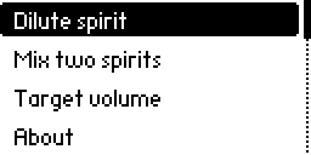
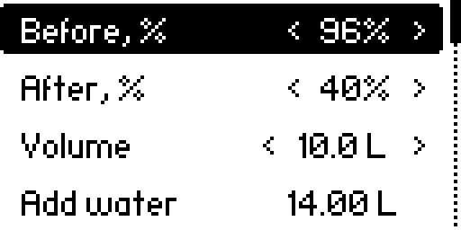
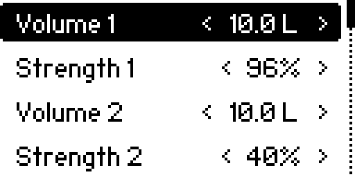
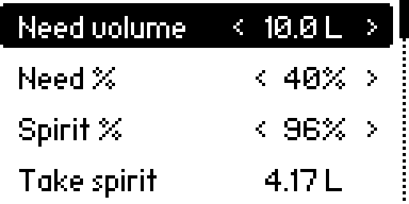
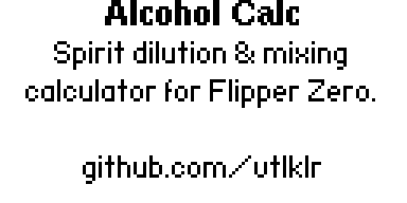

# Alcohol Calc — Flipper Zero app

A small Flipper Zero application for home distillers: calculates spirit dilution and mixing.

## Features

1. **Dilute spirit** — enter starting strength, target strength and volume, get the amount of water to add and the resulting volume.
2. **Mix two spirits** — enter volume and strength of two drinks, get the resulting volume and strength.
3. **Target volume** — enter the desired volume and strength of the final drink plus the strength of your spirit, get how much spirit and water to take.

All values are edited with the ◀ ▶ buttons, like in Flipper's own settings menus.

## Screenshots

| Menu | Dilute | Mix |
|---|---|---|
|  |  |  |

| Target volume | About |
|---|---|
|  |  |

## Install

Prebuilt `.fap` files are attached to each GitHub Actions build (see the *Actions* tab → latest run → *Artifacts*). Copy the file to `SD Card/apps/Tools/` on your Flipper, or install it with [qFlipper](https://flipperzero.one/update).

## Build from source

```bash
pip3 install ufbt
ufbt update --channel dev   # or "release", to match your firmware's API version
ufbt build
ufbt launch                 # builds, uploads and launches on a connected Flipper
```

## Author

[github.com/vtlklr](https://github.com/vtlklr)
